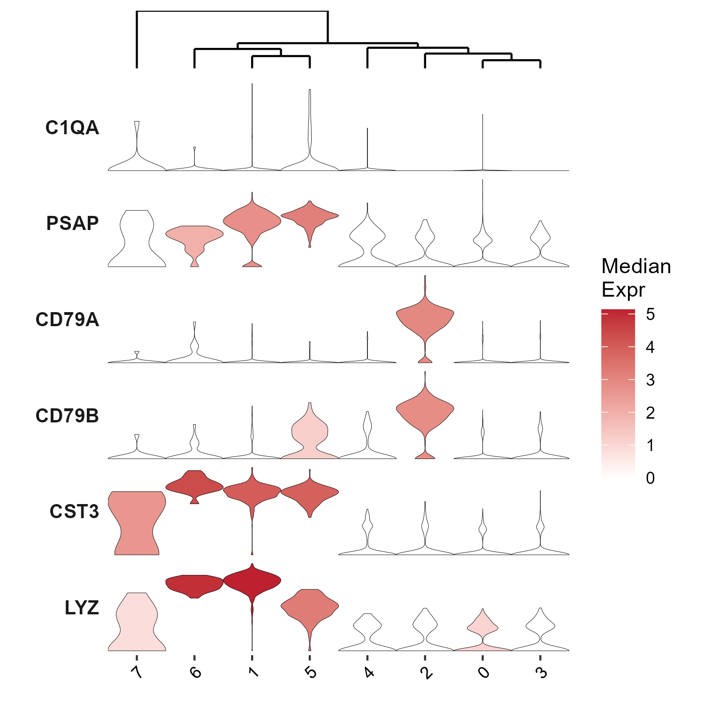

# SeuratVizHelper

**SeuratVizHelper** makes single-cell visualization in Seurat easier and more publication-ready. 

## Features

#### 🇺🇸 English
**Bring Scanpy-style aesthetics to Seurat.**
- 📊 **Stacked Violin Plots**: Create compact, Scanpy-style stacked violin plots colored by median expression.
- 🌳 **Automatic Clustering**: Dendrogram-based cluster ordering `BuildClusterTree()`
- 🎨 **Customizable**: Adjustable colors, sizes, and cluster orders
- 💾 **Easy Export**: Built-in .png saving.

#### 🇯🇵 日本語
**SeuratでScanpyライクな可視化を実現。**
- 📊 **スタックバイオリンプロット**: Scanpy風の発現中央値で色付けされた積層型バイオリンプロットを簡単に描画。
- 🌳 **自動クラスタリング**: BuildClusterTree() のデンドログラムに基づき、クラスタ順序を自動で生物学的に整列。
- 🎨 **高いカスタマイズ性**: 色、サイズ、表示順序を柔軟に調整可能。
- 💾 **簡単保存: 高解像度** .png 出力機能を内蔵。

#### 🇨🇳 中文 (Simplified)
**在 Seurat 中实现 Scanpy 风格的可视化。**
- 📊 **堆叠小提琴图**: 绘制 Scanpy 风格的堆叠小提琴图 (Stacked Violin Plot)，并根据表达中位数填充颜色。
- 🌳 **自动聚类排序**: 利用 BuildClusterTree() 树状图自动调整聚类顺序。
- 🎨 **高度可定制**: 灵活调整颜色、尺寸和基因分组。
- 💾 **便捷导出**: 内置高分辨率 .png 保存功能。

#### 🇩🇪 Deutsch
**Scanpy-artige Ästhetik für Seurat.**
- 📊 **Gestapelte Violin-Plots**: Erstellen Sie kompakte, Scanpy-artige gestapelte Violin-Plots, gefärbt nach **Median-Expression**.
- 🌳 **Automatische Cluster-Sortierung**: Automatische Anordnung der Cluster basierend auf `BuildClusterTree()` Dendrogrammen.
- 🎨 **Anpassbar**: Farben, Größen und Cluster-Reihenfolgen sind flexibel einstellbar.
- 💾 **Einfacher Export**: Integrierte Funktion zum Speichern hochauflösender `.png`-Dateien.

#### 🇪🇸 Español
**Estética estilo Scanpy en Seurat.**
- 📊 **Gráficos de Violín Apilados**: Cree gráficos compactos estilo Scanpy, coloreados según la **expresión mediana**.
- 🌳 **Agrupamiento Automático**: Reordenación automática de clústeres basada en dendrogramas de `BuildClusterTree()`.
- 🎨 **Personalizable**: Colores, tamaños y orden de clústeres totalmente ajustables.
- 💾 **Exportación Fácil**: Guardado integrado de imágenes `.png` de alta resolución.

#### 🇵🇹 Português
**Estética estilo Scanpy no Seurat.**
- 📊 **Violin Plots Empilhados**: Crie plots compactos estilo Scanpy, coloridos pela **expressão mediana**.
- 🌳 **Clusterização Automática**: Reordenação automática de clusters baseada em dendrogramas do `BuildClusterTree()`.
- 🎨 **Personalizável**: Cores, tamanhos e ordens de clusters totalmente ajustáveis.
- 💾 **Exportação Fácil**: Salvamento integrado em `.png` de alta resolução.

#### 🇮🇩 Bahasa Indonesia
**Hadirkan estetika gaya Scanpy ke Seurat.**
- 📊 **Stacked Violin Plots**: Buat plot biola bertumpuk gaya Scanpy yang ringkas, diwarnai berdasarkan **ekspresi median**.
- 🌳 **Klasterisasi Otomatis**: Pengurutan ulang klaster secara otomatis berdasarkan dendrogram `BuildClusterTree()`.
- 🎨 **Dapat Disesuaikan**: Warna, ukuran, dan urutan klaster yang fleksibel.
- 💾 **Ekspor Mudah**: Fitur penyimpanan `.png` resolusi tinggi bawaan.

#### 🇫🇷 Français
**Apportez l'esthétique de Scanpy à Seurat.**
- 📊 **Tracés en Violon Empilés**: Créez des "Stacked Violin Plots" compacts de style Scanpy, colorés par **expression médiane**.
- 🌳 **Clustering Automatique**: Réorganisation automatique des clusters basée sur les dendrogrammes de `BuildClusterTree()`.
- 🎨 **Personnalisable**: Couleurs, tailles et ordres des clusters entièrement ajustables.
- 💾 **Export Facile**: Fonction intégrée pour sauvegarder en `.png` haute résolution.

#### 🇰🇷 한국어
**Seurat에 Scanpy 스타일의 미학을 더하세요.**
- 📊 **스택 바이올린 플롯**: **중앙값 발현(median expression)**으로 채색된 컴팩트한 Scanpy 스타일의 스택 바이올린 플롯을 생성합니다.
- 🌳 **자동 클러스터링**: `BuildClusterTree()` 덴드로그램을 기반으로 클러스터 순서를 자동으로 재정렬합니다.
- 🎨 **사용자 정의 가능**: 색상, 크기 및 클러스터 순서를 완벽하게 조정할 수 있습니다.
- 💾 **간편한 내보내기**: 고해상도 `.png` 저장 기능이 내장되어 있습니다.

#### 🇷🇺 Русский
**Эстетика в стиле Scanpy для Seurat.**
- 📊 **Стекированные Скрипичные Диаграммы**: Создавайте компактные диаграммы в стиле Scanpy, окрашенные по **медианной экспрессии**.
- 🌳 **Автоматическая Кластеризация**: Автоматическое переупорядочивание кластеров на основе дендрограмм `BuildClusterTree()`.
- 🎨 **Настраиваемость**: Полностью настраиваемые цвета, размеры и порядок кластеров.
- 💾 **Легкий Экспорт**: Встроенная функция сохранения в высоком разрешении `.png`.

---
## AI Usage

This package was made by AI coding tools (Gemini and Github copilot)

## Installation

Install directly from GitHub:

```r
# install.packages("devtools")
devtools::install_github("AyumuOkumura/SeuratVizHelper")
```

## Quick Start

```r
library(Seurat)
library(SeuratVizHelper)

# Load your Seurat object
seurat_obj <- readRDS("seurat_obj.rds")

# Create a stacked violin plot (uses DefaultAssay automatically)
# Save to file
ndim = 20
StackVln(
  seurat_object = seurat_obj,
  features = c("IL7R", "CCR7", "S100A4"),
  group.by = "seurat_clusters",
  dendrogram_method = "dims",
  ndim = ndim, # default 30 dimensions (ndim not specified)
  plot_width = 12,
  plot_heights = c(0.3, 3),
  # Define the height ratio between the "top graph (dendrogram)" and "bottom graph (violin plot)"
  save_dir = "./figures",
         )

genes <- c("CD3D", "CD8A", "CD4", "MS4A1", "CD14")

# With custom tag for organizing marker sets
StackVln(
  seurat_object = seurat_obj,
  features = genes,
  group.by = "seurat_clusters",
  dendrogram_method = "dims",
  ndim = 30,
  plot_width = 5,
  plot_heights = c(0.3, 3), 
  color_high = "#BD2130",
  tag = "immune_markers",  # Adds descriptive tag to filename
  save_dir = file.path("png/ViolinPlot")
)
# Output: seurat_obj_immune_markers_stack_vln.png
```
## Output

### Default Filename Format
When using `save_dir`, the output filename follows this pattern:
- **Without tag**: `{seurat_object}_stack_vln.png`
- **With tag**: `{seurat_object}_{tag}_stack_vln.png`

### Examples

```r
# Default filename
StackVln(seurat_obj, features = c("CD3D", "CD8A"), save_dir = "./plots")
# Output: seurat_obj_stack_vln.png

# With tag - for organizing different marker sets
StackVln(seurat_obj, features = c("CD3D", "CD8A", "CD4"), 
         save_dir = "./plots", tag = "tcells")
# Output: seurat_obj_tcells_stack_vln.png

StackVln(seurat_obj, features = c("MS4A1", "CD79A"), 
         save_dir = "./plots", tag = "bcells")
# Output: seurat_obj_bcells_stack_vln.png
```

**Note**: The `tag` parameter is only used when `save_dir` is specified. If you use `save_path` to provide a full file path, the `tag` parameter will be ignored.



## How StackVln Works: Step-by-Step Computation Details

Understanding the computational workflow behind `StackVln()` helps you make informed decisions about parameters and interpret your results. Here's what happens under the hood:

### Step 1: Data Preparation and Validation

1. **Assay Selection**: If no assay is specified, the function uses `DefaultAssay()` to select the assay
2. **Feature Validation**: The function checks that requested features exist in the selected assay
3. **Group Validation**: Verifies that the `group.by` column exists in the Seurat object's metadata

### Step 2: Cluster Tree Construction

The dendrogram is built using Seurat's `BuildClusterTree()` function. The computation method depends on your `dendrogram_method` parameter:

#### Method A: "dims" (Recommended)
```
1. Extract dimensionality reduction data (e.g., PCA)
   → Uses the specified reduction (default: "pca")
   
2. Calculate cluster centroids in reduced space
   → For each cluster, computes mean coordinates across specified dimensions (default: 1:30)
   
3. Compute pairwise distances between cluster centroids
   → Uses Euclidean distance in the reduced dimensional space
   
4. Perform hierarchical clustering
   → Method: Ward's linkage
   → Creates dendrogram based on cluster similarities
```

**Advantages**: Computationally efficient, robust to noise, captures global transcriptomic relationships

#### Method B: "features"
```
1. Extract expression data for specified features only
   → Uses only the genes you're plotting
   
2. Calculate average expression per cluster
   → For each cluster, computes mean expression of each feature
   
3. Compute correlation/distance between clusters
   → Based solely on the selected marker genes
   
4. Build hierarchical tree
   → Ward's linkage clustering on feature-specific relationships
```

**Advantages**: Shows relationships specific to your markers, useful for focused analysis

#### Method C: "all_variable"
```
1. Identify all variable features in the assay
   → Uses features marked as variable in Seurat object
   
2. Extract expression matrix for all variable features
   → Typically 2000-3000 genes
   
3. Calculate cluster-wise average expression
   → Mean expression across all variable features
   
4. Perform hierarchical clustering
   → Creates comprehensive gene-based dendrogram
```

**Advantages**: Comprehensive gene-based approach, no dimensionality reduction needed

### Step 3: Cluster Ordering

1. **Extract dendrogram structure** from the built cluster tree
2. **Determine optimal leaf order** using hierarchical clustering results
3. **Override with manual order** if `cluster_order` is specified by user

### Step 4: Expression Data Extraction and Scaling

```
For each feature:
1. Extract raw expression values from the specified assay
2. Group cells by cluster (using group.by parameter)
3. Scale expression to 0-1 range within each feature
   → Formula: (value - min) / (max - min)
   → This enables color mapping across different expression scales
```

### Step 5: Violin Plot Generation

```
For each feature × cluster combination:
1. Extract expression distribution for all cells in that cluster
2. Calculate kernel density estimation
   → Creates smooth distribution curve
3. Mirror the density plot to create violin shape
4. Color violin by mean expression (scaled 0-1)
   → Low expression → color_low (default: white)
   → High expression → color_high (default: #BD2130)
```

### Step 6: Layout Assembly

1. **Create dendrogram plot** with height ratio from `plot_heights[1]`
2. **Create stacked violin plots** with height ratio from `plot_heights[2]`
3. **Align plots** vertically using `patchwork` package
4. **Calculate total plot height**: 
   - If not specified: `max(5, length(features) × 0.4 + 2)` inches
   - Ensures adequate space for all features

### Step 7: Export

1. **Create output directory** if it doesn't exist
2. **Save plot** as PNG with specified dimensions
   - Default filename: `{seurat_object_name}_stack_vln.png`
   - Resolution: High-quality for publication

### Key Computational Notes

- **Memory efficiency**: The function processes one feature at a time rather than loading all data at once
- **Scaling strategy**: Per-feature scaling (not global) ensures each gene is visually comparable
- **Clustering algorithm**: Uses Ward's criterion (`ward.D2`) which minimizes within-cluster variance
- **Distance metric**: Euclidean distance in PCA space (for "dims" method) or expression space (other methods)

## Advanced Usage
### Custom Colors

```r
StackVln(
  seurat_object = seurat_obj,
  features = c("IL7R", "CCR7", "S100A4"),
  group.by = "seurat_clusters",
  dendrogram_method = "dims",
  plot_width = 12,
  plot_heights = c(0.3, 3),
  color_low = "lightblue",
　color_high = "darkred",
  save_dir = "./figures",
         )
```

### Handling Long Cluster Names

When your cluster names are long, they may be cut off at the bottom of the plot. Use the `x_label_margin` parameter to adjust the bottom margin and ensure labels are fully visible.

#### Default Behavior
```r
# Default margin (1 inch) - suitable for short cluster names
StackVln(seurat_obj, 
         features = c("CD3D", "CD8A"),
         group.by = "seurat_clusters")
# Works well for names like: "0", "1", "CD4 T", "CD8 T"
```

#### Adjusting Margin for Long Names
```r
# Moderate adjustment for medium-length names
StackVln(seurat_obj, 
         features = c("CD3D", "CD8A"),
         group.by = "cell_type",
         x_label_margin = 1.5)
# Good for: "Naive CD4 T", "Memory B cells"

# Larger adjustment for long names
StackVln(seurat_obj, 
         features = c("CD3D", "CD8A"),
         group.by = "detailed_annotation",
         x_label_margin = 2.5)
# Good for: "CD8+ Effector Memory T cells"

# Maximum adjustment for very long names
StackVln(seurat_obj, 
         features = c("CD3D", "CD8A"),
         x_label_margin = 3)
# Good for: "CD4+ Central Memory T cells (CCR7+)"
```

**Tip**: Start with the default value and incrementally increase by 0.5 inches until all labels are visible.

### Dendrogram Calculation Methods

The `StackVln()` function uses Seurat's `BuildClusterTree()` to calculate hierarchical relationships between clusters. Three methods are available:

#### Method 1: Using Dimensionality Reduction (Recommended)

This method uses PCA or other dimensionality reduction results to calculate cluster relationships. It's computationally efficient and robust to noise.

```r
# Use first 50 PCA dimensions
StackVln(seurat_obj,
         features = c("CD3D", "CD8A", "CD4"),
         dendrogram_method = "dims",
         ndim = 50,
         reduction_for_tree = "pca")

# Use default 30 dimensions (ndim not specified)
StackVln(seurat_obj,
         features = c("CD3D", "CD8A", "CD4"),
         dendrogram_method = "dims")
```

**When to use:**
- Standard workflow for most analyses
- When you have performed PCA or other dimensionality reduction
- For robust clustering relationships across the full transcriptome

**Note:** If `ndim` is not specified, the function defaults to using dimensions 1:30 and displays a message.

#### Method 2: Using Plot Features Only

This method calculates the dendrogram based only on the genes you're plotting.
dendrogram_method = "features"

```r
StackVln(seurat_obj,
         features = c("CD3D", "CD8A", "CD4", "MS4A1", "CD14"),
         dendrogram_method = "features")
```

**When to use:**
- When you want cluster relationships specific to your marker genes
- For focused analysis on a particular gene set
- When your features are carefully selected markers

#### Method 3: Using All Variable Features

This method uses all variable features identified in your Seurat object.

```r
StackVln(seurat_obj,
         features = c("CD3D", "CD8A"),
         dendrogram_method = "all_variable")
```

**When to use:**
- When you want comprehensive gene-based clustering
- As an alternative to dimensionality reduction method
- When you don't have dimensionality reduction results

### Plot Size Customization

Control the dimensions of your plots for optimal visualization and publication quality.

#### Automatic Height Calculation

By default, plot height is automatically calculated based on the number of features:
- Formula: `calc_height = max(5, length(features) * 0.4 + 2)`
- Minimum: 5 inches
- Scales: 0.4 inches per feature + 2 inches base

Examples:
- 3 features → 5 inches (minimum)
- 10 features → 6 inches
- 20 features → 10 inches

#### Adjusting Plot Width

```r
# Wider plot for many clusters
StackVln(seurat_obj,
         features = c("CD3D", "CD8A"),
         plot_width = 15)
```

#### Controlling Dendrogram vs Violin Ratio

The `plot_heights` parameter controls the relative space allocated to dendrogram and violin plots:

```r
# Default: minimal dendrogram, focus on violins
StackVln(seurat_obj, features = genes, plot_heights = c(1, 9))

# Emphasize dendrogram
StackVln(seurat_obj, features = genes, plot_heights = c(2, 8))

# Larger dendrogram for detailed branch structure
StackVln(seurat_obj, features = genes, plot_heights = c(3, 7))

# Minimal dendrogram
StackVln(seurat_obj, features = genes, plot_heights = c(0.5, 9.5))
```

## Troubleshooting

### Cluster Names are Cut Off

**Problem**: Long cluster names are truncated at the bottom of the saved plot.

**Solution**: Increase the `x_label_margin` parameter:
```r
StackVln(seurat_obj, 
         features = genes,
         x_label_margin = 2)  # Increase from default 1
```

Try values between 1 and 3 depending on your label length.

### Plot Height Issues

**Problem**: The plot is too tall or too short.

**Solution**: The height is automatically calculated based on the number of features. For manual control, you can save the plot object and use `ggsave()` with custom dimensions:
```r
p <- StackVln(seurat_obj, features = genes)
ggsave("custom_plot.png", p, width = 10, height = 8, dpi = 300)
```

## Function Arguments

- `seurat_object`: Seurat object containing the assay data
- `features`: Character vector of gene names to plot
- `group.by`: Column name in meta.data for grouping (default: "seurat_clusters")
- `cluster_order`: Optional character vector to specify cluster order manually
- `assay`: Assay to use (default: NULL, automatically uses DefaultAssay())
- `color_low`: Color for low expression (default: "white")
- `color_high`: Color for high expression (default: "#BD2130")
- `plot_heights`: Numeric vector (length=2) for relative heights of dendrogram and violin (default: c(1, 9))
- `plot_width`: Width of the saved plot in inches (default: 10)
- `x_label_margin`: Bottom margin space for x-axis labels in inches (default: 1). Increase this value if cluster names are cut off at the bottom of the plot. Recommended range: 1-3 inches depending on label length.
- `save_path`: Full path to save the file. Overrides save_dir
- `save_dir`: Directory to save the file using a default filename
- `tag`: Optional tag to add to the filename (default: NULL). When specified with save_dir, generates `{seurat_object}_{tag}_stack_vln.png` instead of `{seurat_object}_stack_vln.png`. Ignored when save_path is used.
- `ndim`: Number of dimensions for dendrogram (when method = "dims", default: NULL = 30)
- `dendrogram_method`: Calculation method: "features", "dims" (recommended), or "all_variable" (default: "features")
- `reduction_for_tree`: Reduction to use for "dims" method (default: "pca")

## Citation

If you use SeuratVizHelper in your research, please cite:

```
Okumura, A. (2026). SeuratVizHelper: Enhanced Visualization for Seurat.
R package version 0.0.0.9000.
https://github.com/AyumuOkumura/SeuratVizHelper
```

## License

MIT License

## Issues & Contributions

Please report issues at: https://github.com/AyumuOkumura/SeuratVizHelper/issues
Contributions are welcome via pull requests!

## acknowledgement

- seurat <https://satijalab.org/seurat/>
- scannpy stacked_violin <https://scanpy.readthedocs.io/en/stable/generated/scanpy.pl.stacked_violin.html>

## 🌍 Multilingual Overview
#### 🇯🇵 日本語
**SeuratでScanpyライクな可視化を実現。**
- 📊 **スタックバイオリンプロット**: Scanpy風の発現中央値で色付けされた積層型バイオリンプロットを簡単に描画。
- 🌳 **自動クラスタリング**: BuildClusterTree() のデンドログラムに基づき、クラスタ順序を自動で生物学的に整列。
- 🎨 **高いカスタマイズ性**: 色、サイズ、表示順序を柔軟に調整可能。
- 💾 **簡単保存: 高解像度** .png 出力機能を内蔵。

#### 🇨🇳 中文 (Simplified)
**在 Seurat 中实现 Scanpy 风格的可视化。**
- 📊 **堆叠小提琴图**: 绘制 Scanpy 风格的堆叠小提琴图 (Stacked Violin Plot)，并根据表达中位数填充颜色。
- 🌳 **自动聚类排序**: 利用 BuildClusterTree() 树状图自动调整聚类顺序。
- 🎨 **高度可定制**: 灵活调整颜色、尺寸和基因分组。
- 💾 **便捷导出**: 内置高分辨率 .png 保存功能。

#### 🇩🇪 Deutsch
**Scanpy-artige Ästhetik für Seurat.**
- 📊 **Gestapelte Violin-Plots**: Erstellen Sie kompakte, Scanpy-artige gestapelte Violin-Plots, gefärbt nach **Median-Expression**.
- 🌳 **Automatische Cluster-Sortierung**: Automatische Anordnung der Cluster basierend auf `BuildClusterTree()` Dendrogrammen.
- 🎨 **Anpassbar**: Farben, Größen und Cluster-Reihenfolgen sind flexibel einstellbar.
- 💾 **Einfacher Export**: Integrierte Funktion zum Speichern hochauflösender `.png`-Dateien.

#### 🇪🇸 Español
**Estética estilo Scanpy en Seurat.**
- 📊 **Gráficos de Violín Apilados**: Cree gráficos compactos estilo Scanpy, coloreados según la **expresión mediana**.
- 🌳 **Agrupamiento Automático**: Reordenación automática de clústeres basada en dendrogramas de `BuildClusterTree()`.
- 🎨 **Personalizable**: Colores, tamaños y orden de clústeres totalmente ajustables.
- 💾 **Exportación Fácil**: Guardado integrado de imágenes `.png` de alta resolución.

#### 🇵🇹 Português
**Estética estilo Scanpy no Seurat.**
- 📊 **Violin Plots Empilhados**: Crie plots compactos estilo Scanpy, coloridos pela **expressão mediana**.
- 🌳 **Clusterização Automática**: Reordenação automática de clusters baseada em dendrogramas do `BuildClusterTree()`.
- 🎨 **Personalizável**: Cores, tamanhos e ordens de clusters totalmente ajustáveis.
- 💾 **Exportação Fácil**: Salvamento integrado em `.png` de alta resolução.

#### 🇮🇩 Bahasa Indonesia
**Hadirkan estetika gaya Scanpy ke Seurat.**
- 📊 **Stacked Violin Plots**: Buat plot biola bertumpuk gaya Scanpy yang ringkas, diwarnai berdasarkan **ekspresi median**.
- 🌳 **Klasterisasi Otomatis**: Pengurutan ulang klaster secara otomatis berdasarkan dendrogram `BuildClusterTree()`.
- 🎨 **Dapat Disesuaikan**: Warna, ukuran, dan urutan klaster yang fleksibel.
- 💾 **Ekspor Mudah**: Fitur penyimpanan `.png` resolusi tinggi bawaan.

#### 🇫🇷 Français
**Apportez l'esthétique de Scanpy à Seurat.**
- 📊 **Tracés en Violon Empilés**: Créez des "Stacked Violin Plots" compacts de style Scanpy, colorés par **expression médiane**.
- 🌳 **Clustering Automatique**: Réorganisation automatique des clusters basée sur les dendrogrammes de `BuildClusterTree()`.
- 🎨 **Personnalisable**: Couleurs, tailles et ordres des clusters entièrement ajustables.
- 💾 **Export Facile**: Fonction intégrée pour sauvegarder en `.png` haute résolution.

#### 🇰🇷 한국어
**Seurat에 Scanpy 스타일의 미학을 더하세요.**
- 📊 **스택 바이올린 플롯**: **중앙값 발현(median expression)**으로 채색된 컴팩트한 Scanpy 스타일의 스택 바이올린 플롯을 생성합니다.
- 🌳 **자동 클러스터링**: `BuildClusterTree()` 덴드로그램을 기반으로 클러스터 순서를 자동으로 재정렬합니다.
- 🎨 **사용자 정의 가능**: 색상, 크기 및 클러스터 순서를 완벽하게 조정할 수 있습니다.
- 💾 **간편한 내보내기**: 고해상도 `.png` 저장 기능이 내장되어 있습니다.

#### 🇷🇺 Русский
**Эстетика в стиле Scanpy для Seurat.**
- 📊 **Стекированные Скрипичные Диаграммы**: Создавайте компактные диаграммы в стиле Scanpy, окрашенные по **медианной экспрессии**.
- 🌳 **Автоматическая Кластеризация**: Автоматическое переупорядочивание кластеров на основе дендрограмм `BuildClusterTree()`.
- 🎨 **Настраиваемость**: Полностью настраиваемые цвета, размеры и порядок кластеров.
- 💾 **Легкий Экспорт**: Встроенная функция сохранения в высоком разрешении `.png`.

---
### 🏷️ Keywords / Tags
`R` `Seurat` `scRNA-seq` `Single-cell Visualization` `Stacked Violin Plot` `Scanpy` `BuildClusterTree` `Dendrogram`
---
